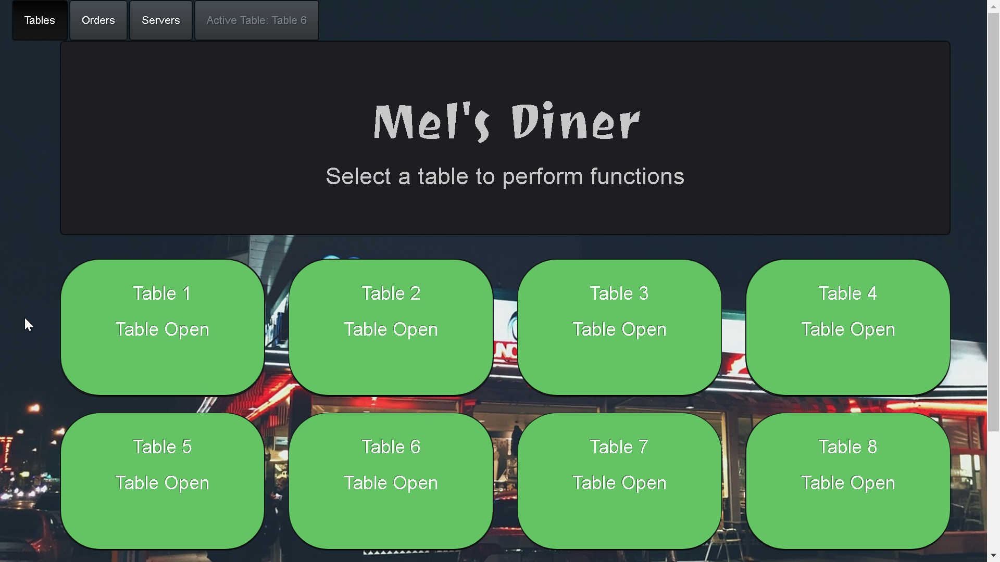
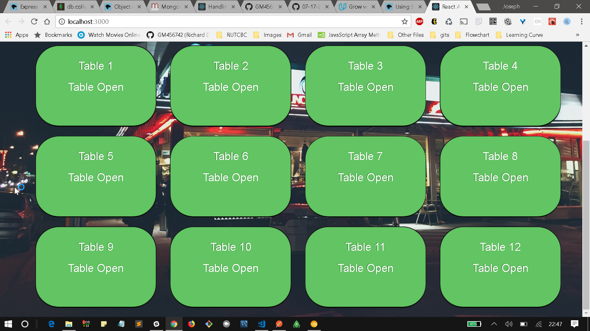
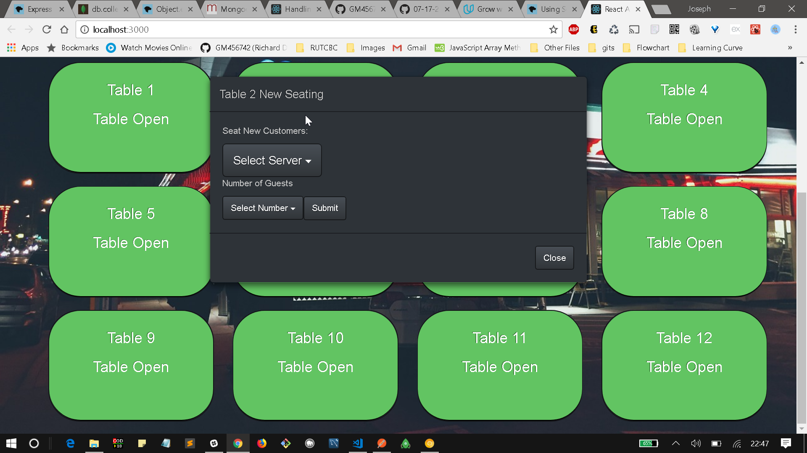
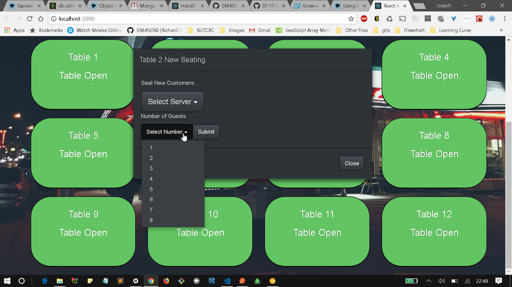
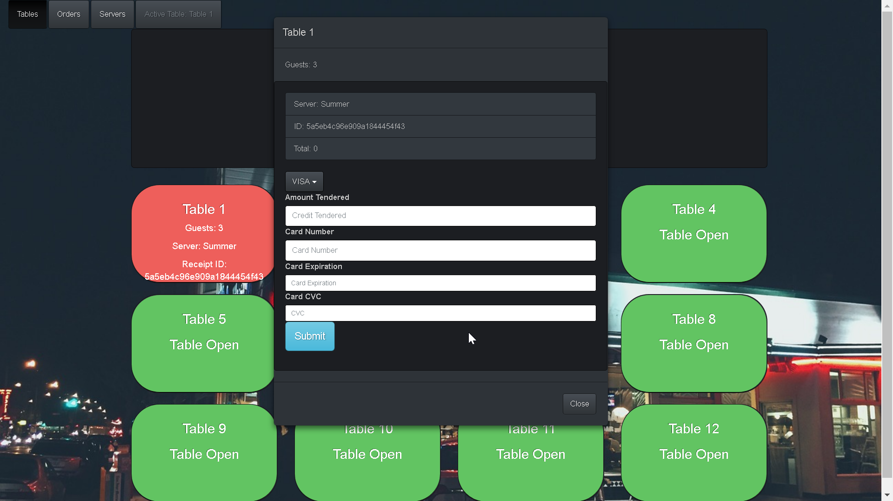

# Restaurant-PoS 

By [Richard Debrah](https://github.com/GM456742), [Richard Bates](https://github.com/Richwb) and [Jim Reinknecht](https://github.com/CaptainJimmy)

Restaurant PoS is a simple React application for managing restaurant seating. It's features include handling orders for multiple guests and receipt printing. Restaurant PoS is lightweight making it easy to run on very low memory systems.

# Dependencies
Restaurant PoS depends on several NPM Packages. Find below the various packages and their versions used. 
Install with `$ npm install`.

* [React](https://reactjs.org/) &middot; 
 
* [Concurrently](https://www.npmjs.com/package/concurrently) &middot; 
 
* [MongoDB](https://www.npmjs.com/package/mongodb) &middot; 
 
* [Cors](https://www.npmjs.com/package/cors) &middot; 
 
* [Express](https://www.npmjs.com/package/express) &middot; 
 
* [Mongoose](https://www.npmjs.com/package/mongoose) &middot; 
 
* [Morgan](https://www.npmjs.com/package/morgan) &middot; 
  
* [Nodemon](https://www.npmjs.com/package/nodemon) &middot; 
  
* [React-Bootstrap](https://www.npmjs.com/package/react-bootstrap) &middot; 
 
* [Serve-Favicon](https://www.npmjs.com/package/serve-favicon) &middot; 
 
* [Axios](https://www.npmjs.com/package/axios) &middot; 

* [React-Alert](https://www.npmjs.com/package/react-alert) &middot;
 
 
Installation Instructions:

1) Clone Repository to your local drive
2) From your favorite terminal enter `$ cd Restaurant-PoS`
3) Run `$ npm install` to install packages
4) `$ cd client`
5) Run `$ npm install` to install React packages
6) `$ cd ..` into the main app folder
7) In the app folder run `$ npm start` to run the app. Happy Hacking!

# Contribution
The main purpose of this repository is to continue to test React core, making it accessible and easier to understand and use. Development of this application happens in the open on GitHub, and we are grateful to the [Rutgers Coding Bootcamp Community](https://github.com/RutgersCodingBootcamp) for contributing efforts and improvements.

# Future Updates
* Managing Servers/Waiters/Waitresses from the front end
* Receipt by sms
* Coupons and Gift cards integration
* Administrative section to manage service, menu, and employees
* SMS integration for waiting
* Guest tableside ordering system

# Application Instances
*Main Page*

*Modal for seating new Guests*

*Active/Seated Table*

*Making Orders*

*Order Submission Confirmation*

*Current Servers*

*Checking Out Guests*
